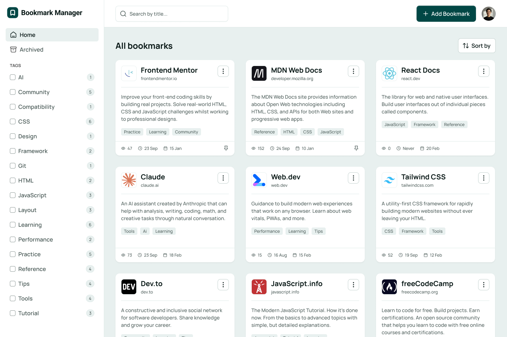
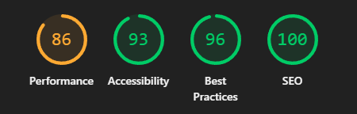

# Bookmark Manager App

Full-stack bookmark manager (Frontend Mentor challenge) with a Next.js frontend and a Node.js/Express backend.

- Frontend: `frontend/` (Next.js App Router)
- Backend: `backend/` (Express API + Prisma)
- Demo mode: runs locally in the browser (no database writes)



## 📋 Contents

- [Features](#features) <!-- feito -->
- [Repo structure](#repo-structure) <!-- feito -->
- [Prerequisites](#prerequisites) <!-- feito -->
- [Quickstart (local)](#quickstart-local) <!-- feito -->
- [Environment variables](#environment-variables) <!-- feito -->
- [Scripts](#scripts) <!-- feito -->
- [API](#api) <!-- feito -->
- [Database (Prisma)](#database-prisma) <!-- feito -->
- [Testing](#testing) <!-- feito -->
- [PWA](#pwa) <!-- feito -->
- [Performance (Lighthouse)](#performance-lighthouse) <!-- feito -->
- [Author](#author) <!-- feito -->
- [License](#license) <!-- feito -->

## Features

Users can:

- Add new bookmarks with a title, description, website URL, and tags
- View all their bookmarks
- See bookmark details including favicon, title, URL, description, tags, view count, last visited date, and date added
- Search for bookmarks by title in the search bar
- Filter bookmarks by selecting one or multiple tags from the sidebar
- Reset tag filters to view all bookmarks again
- View archived bookmarks
- Archive bookmarks to remove them from the main view without deleting them
- Pin/unpin bookmarks to keep important ones easily accessible
- Edit existing bookmarks to update their details
- Copy bookmark URLs to the clipboard
- Visit bookmarked websites directly from the app
- Sort bookmarks by "Recently added", "Recently visited", or "Most visited"
- Toggle between light and dark color themes
- View the optimal layout for the interface depending on their device's screen size
- See hover and focus states for all interactive elements on the page

## Repo structure

```
bookmark-manager-app/
  frontend/
    app/
      _components/
      _lib/
      _store/
        __tests__/
      archived/
      demo/
      forgot-password/
      reset-password/
      sign-in/
      sign-up/
    components/
      ui/
    e2e/
      helpers/
    hooks/
    lib/
    public/
      images/
    utils/

  backend/
    src/
      controllers/
      database/
      middlewares/
      models/
      prisma/
        migrations/
      repositories/
      routes/
        auth/
        bookmark/
```

## Prerequisites

- Node.js (LTS recommended)
- npm
- A PostgreSQL database (local or hosted)
- (Optional) Docker/Docker Compose for local DB

## Quickstart (local)

### 1) Backend (API)

From `backend/`:

```sh
cd backend
npm install
```

Set your environment variables (see [Environment variables](#environment-variables)).

Then:

```sh
# common prisma workflow
npx prisma generate
npx prisma migrate deploy

# run API
npm run dev
```

API should be available at `http://localhost:4000` (or your configured `PORT`).

### 2) Frontend (Next.js)

From `frontend/`:

```sh
cd frontend
npm install
npm run dev
```

Open `http://localhost:3000`.

## Environment variables

### Backend (`backend/.env`)

Common variables:

- `DATABASE_URL=postgresql://...`
- `JWT_SECRET=...` (or equivalent, depending on your auth implementation)
- `PORT=4000`
- `ALLOWED_ORIGINS=http://localhost:3000,https://bookmark-manager-app-adriano.vercel.app`

### Frontend (`frontend/.env.local`)

Common variables:

- `NEXT_PUBLIC_API_URL=...` (your backend base URL)
- Any other public flags used by the app

Tip: add `backend/.env.example` and `frontend/.env.local.example` to simplify onboarding.

## Technologies Used

- OS: Windows
- Frontend: Next.js, TypeScript, Tailwind CSS, Zustand, React Hook Form, Radix UI, framer-motion, next-themes, next-pwa
- Backend: Node.js, Express, TypeScript, Prisma, PostgreSQL
- Testing: Jest (unit tests), Playwright (E2E tests)
- Deployment: Vercel (frontend), Render (backend), Neon (database)

## Scripts

### Frontend (`frontend/`)

```sh
npm run dev        # dev server (Turbopack)
npm run build      # build
npm run start      # local production
npm run lint       # eslint
npm run test       # unit tests (Jest)
npm run e2e        # headless E2E (Playwright)
npm run e2e:ui     # Playwright UI
```

### Backend (`backend/`)

```sh
npm run dev        # dev server (ts-node/nodemon, depending on your setup)
npm run build      # tsc build to dist/
npm run start      # node dist/index.js
```

## API

Base paths (backend):

- `/auth/*`
- `/bookmark/*` (protected)

Suggested documentation to add:

- OpenAPI/Swagger (routes + schemas + example responses)

## Database (Prisma)

Prisma files live in `backend/src/prisma/` (schema + migrations).

Common commands:

```sh
npx prisma generate
npx prisma migrate deploy
npx prisma migrate dev
```

## Testing

### Unit tests (Jest) — Frontend

Run from `frontend/`:

```sh
cd frontend
npm run test
```

Run a single test file:

```sh
cd frontend
npx jest app/_store/__tests__/bookmarks.test.ts
npx jest app/_store/__tests__/filters.test.ts
```

Examples (this repo):

- Store: [frontend/app/\_store/**tests**/bookmarks.test.ts](frontend/app/_store/__tests__/bookmarks.test.ts)
- Store: [frontend/app/\_store/**tests**/filters.test.ts](frontend/app/_store/__tests__/filters.test.ts)
- Component: [frontend/app/\_components/bookmark-action-dialog/bookmark-action-dialog.test.tsx](frontend/app/_components/bookmark-action-dialog/bookmark-action-dialog.test.tsx)

Common JSDOM polyfills live in: [frontend/jest.setup.js](frontend/jest.setup.js)

### E2E (Playwright) — Frontend

Run from `frontend/`:

```sh
cd frontend
npm run e2e        # headless
npm run e2e:ui     # headed UI runner
npm run e2e:report # open HTML report
```

Tip: for full determinism locally/CI, run with a single worker:

```sh
cd frontend
npx playwright test --workers=1
```

Specs (this repo):

- Demo/auth: [frontend/e2e/auth-demo.spec.ts](frontend/e2e/auth-demo.spec.ts)
- CRUD flow: [frontend/e2e/bookmarks-crud.spec.ts](frontend/e2e/bookmarks-crud.spec.ts)
- Archive + Pin: [frontend/e2e/archive-pin.spec.ts](frontend/e2e/archive-pin.spec.ts)
- Filters/Tags: [frontend/e2e/filters-tags.spec.ts](frontend/e2e/filters-tags.spec.ts)
- Navigation: [frontend/e2e/navigation.spec.ts](frontend/e2e/navigation.spec.ts)

Helpers:

- Demo bootstrap helper: [frontend/e2e/helpers/demo.ts](frontend/e2e/helpers/demo.ts)

## PWA

- Manifest at [frontend/public/manifest.webmanifest](frontend/public/manifest.webmanifest).
- To test as PWA: build and start production.

```sh
npm run build && npm run start
# access http://localhost:3000 and "Install app" in your browser
```

## Performance (Lighthouse)

- Results:

Desktop



## 👤 Author

**AdrianoEscarabote**

- Github: [@AdrianoEscarabote](https://github.com/AdrianoEscarabote)
- Linkedin: [@AdrianoEscarabote](https://www.linkedin.com/in/AdrianoEscarabote/)
- Frontend Mentor: [@AdrianoEscarabote](https://www.frontendmentor.io/profile/AdrianoEscarabote)
- Twitter: [@drianEscarabote](https://twitter.com/drianEscarabote)

## 📝 License

Copyright © 2026 [AdrianoEscarabote](https://github.com/AdrianoEscarabote).<br />
This project is [MIT](https://github.com/AdrianoEscarabote/bookmark-manager-app/blob/main/LICENSE) licensed.

---

## Show your support

Give a ⭐️ if this project helped you!
